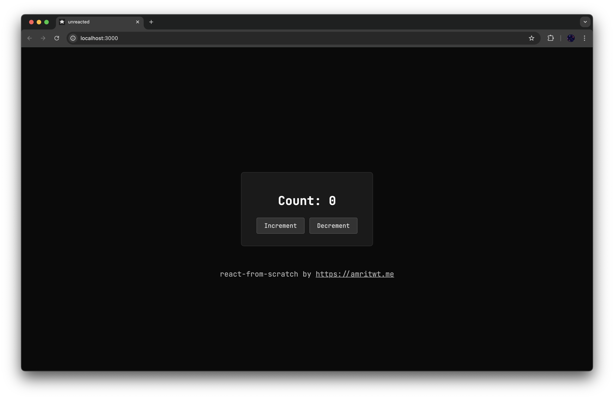

# `unreacted` - `react-from-scratch`

A project exploring the fundamentals of React by building a simplified version from scratch using raw TypeScript. I wrote this to learn how React works under the hood. 

Currently, we have the most popular hooks implemented: `useState`, `useEffect` along with the component logic.

**All with less than 100 lines of code for most of the files.**

**Package size for the core template: 9.7 kB. Unpacked size: 30.4 kB.** (49.8 kB with the favicon :)

Every file in `src/` has a purpose, from rendering to the virtual DOM, to the hooks and the component logic.

The place to work on is `src/app.ts` where you can start building your own components.

It is still raw, so you will need to get to a lower level to write the typescript code.

This is not meant to be production ready (of course), but it is a great way to learn.



## Setup

1.  **Use the CLI to create a new project:**

```bash
npx unreacted project-name
```

or 

```bash
bunx unreacted project-name
```

## Building the Project

This project uses Bun's built-in bundler to compile the TypeScript source code (`src/app.ts`) into a JavaScript file (`dist/bundle.js`) that can be run in a browser.
You can also use `npm` or any other package manager.

First install everything:
```bash
bun install
```

Run the build command:

```bash
bun run build
```

This will create the `dist/bundle.js` file.

## Running the Application

After building the project, open the `index.html` file in your web browser:

```bash
bun run dev
```

This will load the HTML page, which in turn executes the bundled JavaScript (`dist/bundle.js`), rendering the `CounterComponent` into the page.

## Project Structure

-   `index.html`: The main HTML file that hosts the application.
-   `src/`: Contains the source code for the React-like library and components.
    -   `app.ts`: The main application entry point, renders the `CounterComponent`.
    -   `vdom.ts`: Virtual DOM creation and diffing logic.
    -   `hooks.ts`: Implementation of `useState` and `useEffect` hooks.
    -   `renderer.ts`: Component rendering logic.
    -   `index.ts`: Exports library functions (not the application entry point).
-   `dist/`: Contains the bundled JavaScript output.
    -   `bundle.js`: The browser-compatible JavaScript file generated by the build process.
-   `package.json`: Defines project metadata, dependencies, and scripts (including the `build` script).
-   `tsconfig.json`: TypeScript configuration file.
---
